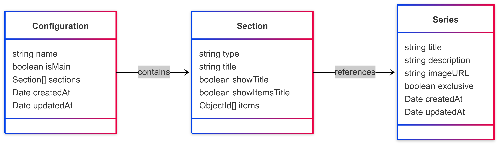

# Holywater – Тестове завдання

Веб-застосунок для адміністраторів, який дозволяє створювати конфігурації головного екрану мобільного застосунку. Адміністратор може додавати секції з різними типами макетів (наприклад, банер, слайдер, вертикальні та горизонтальні списки), змінювати порядок секцій, редагувати вміст та переглядати JSON-конфігурацію, яка буде споживатися мобільним клієнтом.

## 🛠️ Стек технологій

- **Frontend**: React, TypeScript, Vite, TailwindCSS, ShadCN
- **Backend**: Node.js, Express, TypeScript
- **База даних**: MongoDB (Mongoose)

## 🚀 Деплой

Проєкт задеплоєно та доступний за посиланням:

- 🔗 [Фронтенд](https://holywater-test-task.vercel.app/)
- 🔗 [API (GET /api/screen)](https://holywater-test-task-backend.onrender.com/api/screen)

## 📦 Локальний запуск

### Frontend

```bash
cd frontend
yarn
yarn dev
```

### Backend

```bash
cd backend
npm i
npm run dev
```

## 🧩 Схема моделей



## 💡 Припущення

- Один конфіг може бути позначений як `isMain: true` — він буде використовуватись як основний екран.
- В кожній секціїї не має бути однакових серілалів.

## ✅ Реалізований функціонал

- Створення, редагування та видалення конфігурацій.
- Перетягування секцій для зміни порядку.
- Прегляд згенерованого JSON.
- Вибір головної конфігурації (isMain).
- Окрема колекція для серіалів
- Додавання, редагування та видалення секці
  

